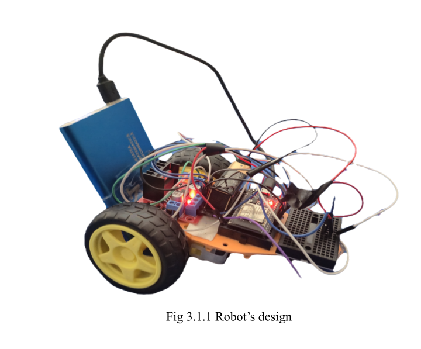
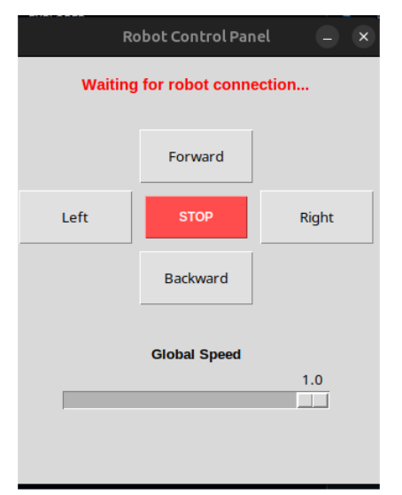

# Semi-Autonomous Mobile Robot

A WiFi-controlled and autonomously navigating mobile robot built with an ESP32 microcontroller, an L298N motor driver, and a Marvelmind indoor GPS system. The robot can be driven manually through a Python GUI, or it can navigate autonomously to a target coordinate using real-time or pre-recorded position data.

---



---

## Overview

This project was developed as part of the Localization and Decision Making for Semi-Autonomous Systems course. The system consists of two main parts:

- **The Robot** — an ESP32-based car with two DC motors, connected to a laptop over WiFi
- **The Server** — a Python application running on the laptop that either sends manual commands via a GUI, or runs an autonomous navigation algorithm using Marvelmind indoor positioning

The robot receives simple text commands over a TCP socket connection: `forward`, `backward`, `left`, `right`, `stop`, and `speed X`.

---

## Hardware

- ESP32-WROOM-32 (WiFi microcontroller)
- L298N H-Bridge Motor Driver
- 2x DC Motors (left and right wheel)
- Marvelmind Indoor GPS Modem (USB, /dev/ttyACM0 or /dev/ttyUSB0)
- Marvelmind Hedgehog (beacon mounted on the robot)
- Power supply / battery pack

### Pin Wiring (ESP32 to L298N)

| ESP32 Pin | L298N Pin | Function |
|-----------|-----------|----------|
| 26 | IN1 | Right motor direction A |
| 13 | IN2 | Right motor direction B |
| 32 | ENA | Right motor speed (PWM) |
| 14 | IN3 | Left motor direction A |
| 27 | IN4 | Left motor direction B |
| 33 | ENB | Left motor speed (PWM) |

---

## Project Structure

```
├── connect.ino                      # ESP32 firmware (Arduino sketch)
├── server.py                        # Manual control GUI (Tkinter)
├── autonomous_sim.py                # Autonomous navigation using CSV log files
├── autonomous_live.py               # Autonomous navigation using live Marvelmind USB data
├── marvelmind.py                    # Marvelmind Python library
├── t1.csv                           # Real recorded position log
├── traseu.csv                       # Real recorded route log
├── test_forward.csv                 # Simulation: robot moves forward 2m
├── test_backward.csv                # Simulation: robot moves backward 2m
├── test_forward_right.csv           # Simulation: forward then right 2m
├── test_forward_left.csv            # Simulation: forward then left 2m
└── test_left_right_forward.csv      # Simulation: left, corrects right, then forward
```

---

## How It Works

### Manual Control

Run `server.py` on the laptop. A GUI window opens with directional buttons and a speed slider. The server waits for the ESP32 to connect, then sends commands whenever a button is pressed.



### Autonomous Navigation (Simulation)

Run `autonomous_sim.py`. It reads position data line by line from a CSV file (simulating what the Marvelmind system would send in real-time). For each position reading it:

1. Calculates the distance to the target
2. Calculates the current heading of the robot (from previous position to current)
3. Calculates the angle towards the target
4. Compares the two angles and sends `left`, `right`, or `forward` accordingly
5. Stops when within 20 cm of the target

### Autonomous Navigation (Live)

Run `autonomous_live.py`. It does the same as the simulation but reads positions in real-time from the Marvelmind USB modem instead of a file.

---

## Setup and Usage

### 1. Flash the ESP32

Open `robot_marvelmind/connect/connect.ino` in Arduino IDE.

- Install board: **esp32 by Espressif Systems** version 2.0.17 via Boards Manager
- Select board: **ESP32 Dev Module**
- Set upload speed to **115200** if upload fails
- Hold the **BOOT button** while uploading if needed

Update the WiFi credentials and server IP inside the sketch:

```cpp
const char* ssid = "your_network";
const char* password = "your_password";
const char* serverAddress = "your_laptop_ip";
```

### 2. Install Python Dependencies

```bash
pip install tkinter
```

The `marvelmind.py` library is already included in the project folder.

### 3. Run Manual Control

```bash
python server.py
```

Power on the robot. It will connect automatically. Use the buttons to drive it.

### 4. Run Autonomous Simulation

Edit `autonomous_sim.py` and set the target coordinates and CSV file:

```python
TARGET_X = 0.000
TARGET_Y = 2.000
run_autonomous_server('test_forward.csv')
```

Then run:

```bash
python autonomous_sim.py
```

Power on the robot. It will connect and start navigating.

### 5. Run Live Autonomous Mode

Connect the Marvelmind modem via USB. If this is your first time on Linux, run:

```bash
sudo usermod -a -G dialout $USER
```

Then restart your session, set your target coordinates in `autonomous_live.py`, and run:

```bash
python autonomous_live.py
```

---

## Navigation Logic

The decision-making uses angle comparison:

- The robot's **current heading** is calculated from the last two known positions
- The **target angle** is calculated from the current position towards the goal
- The **angle difference** is normalized to the range -180 to +180 degrees
- If the difference is greater than **+15 degrees** → turn **left**
- If the difference is less than **-15 degrees** → turn **right**
- Otherwise → go **forward**
- If distance to target is less than **0.2 meters** → **stop**

---

## Turning Calibration

The turn timing values in `connect.ino` can be adjusted depending on your floor surface:

```cpp
int timpInFataInainteDeCurba = 300; // ms to drive forward before turning
int timpRotire90Grade = 350;        // ms to spin in place for a 90 degree turn
```

Increase `timpRotire90Grade` if the robot doesn't turn enough, decrease it if it over-turns.

---

## Test CSV Files

Five pre-made simulation routes are included. Set the matching `TARGET_X` and `TARGET_Y` in `autonomous_sim.py` before using each one:

| File | Start | Target | Path |
|------|-------|--------|------|
| `test_forward.csv` | (0, 0) | (0, 2) | Straight forward |
| `test_backward.csv` | (0, 0) | (0, -2) | Straight backward |
| `test_forward_right.csv` | (0, 0) | (2, 1) | Forward then right |
| `test_forward_left.csv` | (0, 0) | (-2, 1) | Forward then left |
| `test_left_right_forward.csv` | (0, 0) | (0, 2) | Drifts left, corrects, then forward |

---

## Contact

For questions or collaboration: mariusc0023@gmail.com
